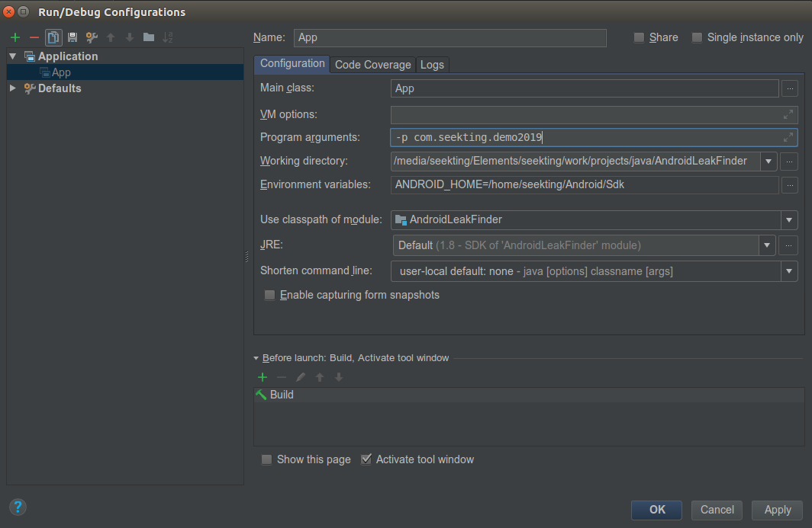

# AndroidLeakFinder

AndroidLeakFinder是一个基于pc端(linux系统)的一个自动找内存泄露的工具，目前仅支持专门对Destroy的Activity做排查，便于开发或测试有目的性的查找内存泄露。
该工具是基于haha库的二次开发，通过haha库找到没有回收的Destory的Activity，然后通过GC-root去顺藤摸瓜式查找（借用LeakCanny核心源码），如果能查到说明有内存泄露。
    
    
    
## 源码使用
源码是android-studio工程，开发者可以用as打开本工程，此程序是一个java可执行程序，入口是App;
运行的时候需要配置ANDROID_HOME环境变量，还要通过配置参数来达到目的

 
可配置的参数如下
```shell {.line-numbers}

#指定hprof和指定类的排查
-t com.seekting.demo2019.LeakActivity -f ./skt/com.seekting.demo2019.LeakActivity.hprof
#指定包名排查
-p com.seekting.demo2019
#基于指定包名最新的hprof排查
-l
```
## 导出jar包
基于leakCanny内存泄露工具，用于Pc端

```java {.line-numbers}

./gradlew jar

```
## 运行jar包(方便测试同学使用)
  可以下载 [](release/AndroidLeakFinder_release.jar) 和 [](./release/haha-2.0.3.jar)这两个jar包。 
   运行的时候cd 到AndroidLeakFinder.jar所在目录

### 显示帮助
```java {.line-numbers}
java -cp  .:pathto/AndroidLeakFinder.jar:pathto/haha-2.0.3.jar  App
```
### 指定hprof和指定类的排查
```java {.line-numbers}

java -cp  .:pathto/AndroidLeakFinder.jar:pathto/haha-2.0.3.jar  App -t com.seekting.demo2019.LeakActivity -f ./skt/com.seekting.demo2019.LeakActivity

```

### 指定包名排查
```java {.line-numbers}
java -cp  .:pathto/AndroidLeakFinder.jar:pathto/haha-2.0.3.jar  App -p com.seekting.demo2019
```

### 基于指定包名最新的hprof排查
```java {.line-numbers}

java -cp  .:pathto/AndroidLeakFinder.jar:pathto/haha-2.0.3.jar  App -l


```

测试方法：
```java {.line-numbers}
java -cp  .:./AndroidLeakFinder.jar:./haha-2.0.3.jar  App -p com.android.browser
java -cp  .:./AndroidLeakFinder.jar:./haha-2.0.3.jar  App -p com.android.browser.debug
java -cp  .:./AndroidLeakFinder.jar:./haha-2.0.3.jar  App -l
java -cp  .:./AndroidLeakFinder.jar:./haha-2.0.3.jar  App -t android.app.Activity -f ../hprof/2019-06-10_10_13_56.hprof


```


## 开发快捷命令
### 显示帮助

```java {.line-numbers}

java -cp  .:./build/libs/AndroidLeakFinder.jar:./libs/haha-2.0.3.jar  App

```
### 指定hprof和指定类的排查
```java {.line-numbers}

java -cp  .:./build/libs/AndroidLeakFinder.jar:./libs/haha-2.0.3.jar  App -t com.seekting.demo2019.LeakActivity -f ./skt/com.seekting.demo2019.LeakActivity

```

### 指定包名排查
```java {.line-numbers}
java -cp  .:./build/libs/AndroidLeakFinder.jar:./libs/haha-2.0.3.jar  App -p com.seekting.demo2019
```

### 基于指定包名最新的hprof排查
```java {.line-numbers}

java -cp  .:./build/libs/AndroidLeakFinder.jar:./libs/haha-2.0.3.jar  App -l

```
## 常见问题

1. 需要java1.8的环境
2. 需要adb环境